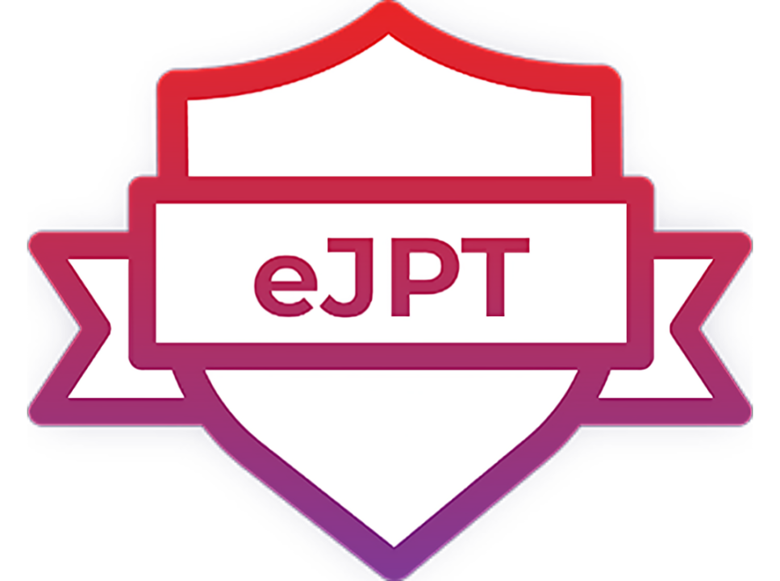

# Ejptv2 Exam Review

I recently passed the eJPTv2 exam, and I wanted to share my experience with you. The eJPTv2 is an entry-level penetration testing certification offered by eLearnSecurity. It covers a wide range of topics, including reconnaissance, enumeration, exploitation, and post-exploitation. The exam is challenging, but it's also a great way to learn the fundamentals of penetration testing.

The PTS course material includes networking basics, basics about how web applications work, BurpSuite, an introduction to programming with Python, Bash scripting, and penetration testing basics (information gathering, footprinting and scanning, enumeration, vulnerability assessments, web attacks, system attacks, and network attacks).

## About Exam.
The eJPT (eLearnSecurity Junior Penetration Tester) exam is a 100% hands-on, practical exam that tests your knowledge and skills in penetration testing and information security essentials. The exam consists of 35 multiple-choice questions, which are divided into three sections:
- Assessment Methodologies: This section tests your knowledge of the different phases of the penetration testing process, including planning, reconnaissance, scanning and enumeration, exploitation, and reporting.
- Host and Network Penetration Testing: This section tests your knowledge of how to identify and exploit vulnerabilities on host and network systems.
- Web Application Penetration Testing: This section tests your knowledge of how to identify and exploit vulnerabilities in web applications.

The exam is open book, so you are allowed to use any resources you want during the exam. However, you are not allowed to communicate with anyone or access the internet during the exam. 

Following are the different types of questions that you can expect to see on the eJPT exam:
- Multiple-choice questions: These questions will test your knowledge of the different concepts covered in the exam.
- Flag-submission questions: In these questions, you will have to find the flag and then submit it.
- Scenario-based questions: These questions will test your ability to apply your knowledge to real-world scenarios.

## Some Tips.

Study for at least 6 months. The eJPTv2 exam covers a lot of material, so it's important to give yourself plenty of time to study. I used a combination of INE training, practice labs, and TryHackMe to prepare for exams.
Get hands-on experience. In addition to studying, it's also important to get hands-on experience with cybersecurity tools and techniques. I did this by doing practice on TryHackMe and INE practice labs and black boxes.
Don't be afraid to ask for help. If you're struggling with a particular topic, don't be afraid to ask for help from a friend, family member, or online forum. There are many people who are willing to help you succeed.

In addition to the tips mentioned above, I would also recommend taking the following steps to prepare for the exam:
- Create a study schedule and stick to it. This will help you stay on track and make sure that you cover all of the material.
- Take practice exams to assess your knowledge and identify areas where you need to improve. This will help you focus your studies on the most important topics.
- Get enough sleep and eat healthy foods on the day of the exam. This will help you stay alert and focused.

I believe that anyone can pass the eJPTv2 exam if they are willing to put in the hard work and dedication. With proper preparation, you can achieve your goal of becoming an eJPT certified cybersecurity professional.
