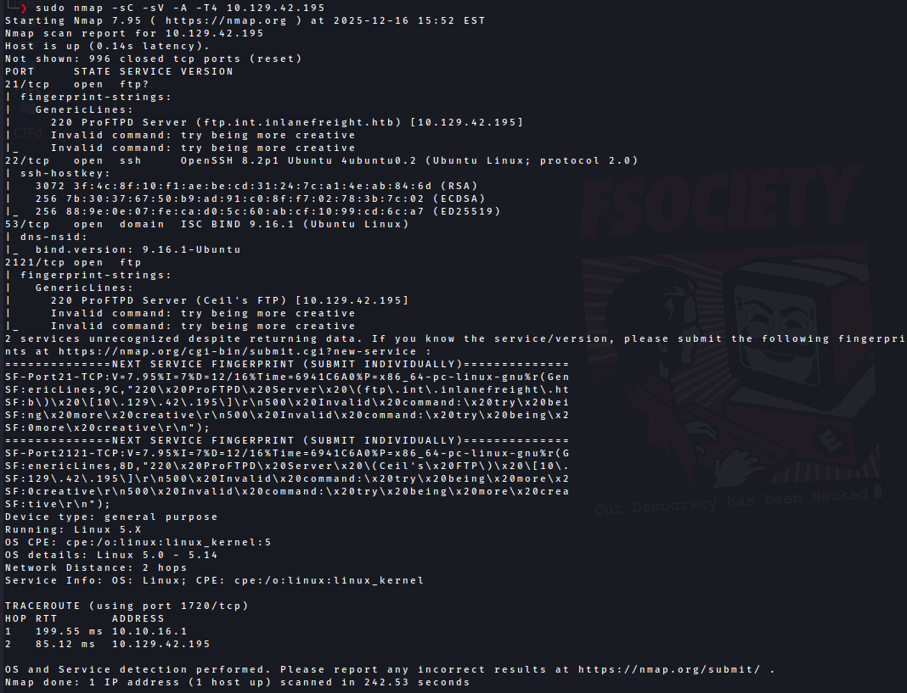
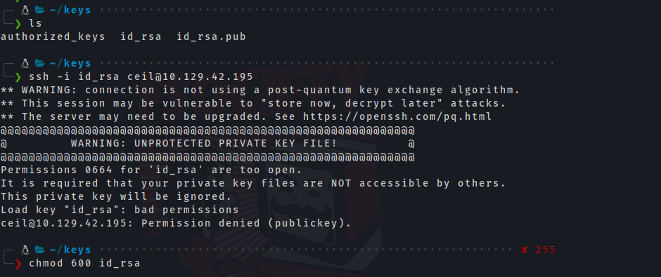
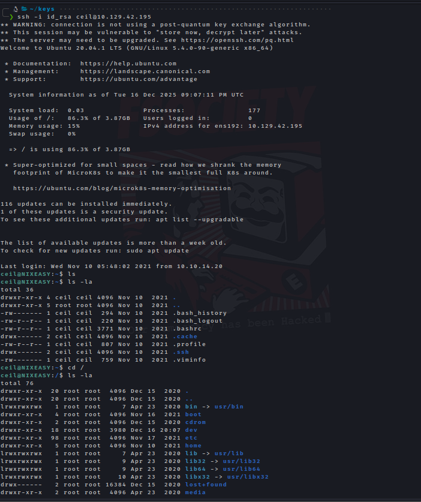
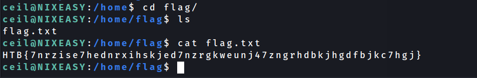

# HTB Academy – Footprinting Skill Assessment Lab (Easy)

## Target Information

* **Organization:** Inlanefreight Ltd
* **Target IP:** 10.129.42.195
* **Lab Name:** ACADEMY-FOOT-SKILL-EASY
* **Difficulty:** Easy
* **Objective:** Fully enumerate the target server and retrieve the contents of `flag.txt`.


## Scope & Rules of Engagement

* The target is part of an **internal network**.
* Services are **in production**.
* **Aggressive exploitation is forbidden**.
* The task focuses on **enumeration, misconfiguration discovery, and information abuse**.

Provided intelligence:

* Valid credentials: `ceil:qwer1234`
* Employees mentioned **SSH keys** on a forum


## Step 1: Initial Service Enumeration

An initial Nmap scan was performed to identify exposed services:

```bash
nmap -sC -sV -A -T4 10.129.42.195
```

### Key Findings

* **21/tcp** – FTP (ProFTPD)
* **22/tcp** – SSH (OpenSSH 8.2p1, key-based authentication)
* **53/tcp** – DNS (ISC BIND 9.16.1)
* **2121/tcp** – Alternate FTP service (ProFTPD – Ceil's FTP)

This indicated a server hosting **DNS, FTP, and SSH**, with SSH restricted to key-based authentication.




## Step 2: DNS Enumeration (Critical Pivot)

Since the target is an internal DNS server, a **zone transfer** was attempted.

```bash
dig axfr @10.129.42.195 inlanefreight.htb
```

### Result

The zone transfer was **successful**, revealing internal DNS records:

* `app.inlanefreight.htb`
* `mail1.inlanefreight.htb`
* `ns.inlanefreight.htb`
* `internal.inlanefreight.htb`

This represents a **critical DNS misconfiguration**, exposing internal infrastructure details.

Some internal hosts were unreachable from the attacker’s network, which is realistic in real-world internal pentests.


## Step 3: FTP Enumeration

Using the provided credentials, FTP access was tested on the alternate FTP service:

```bash
ftp 10.129.42.195 2121
```

Credentials used:

```
Username: ceil
Password: qwer1234
```

### Findings

* Successful login
* Access to the user home directory
* Presence of a `.ssh` directory

Listing `.ssh`:

* `authorized_keys`
* `id_rsa`
* `id_rsa.pub`

This directly aligned with the earlier hint about **SSH keys**.


## Step 4: SSH Key Extraction

The SSH keys were downloaded directly via FTP:

```ftp
get authorized_keys
get id_rsa
get id_rsa.pub
```

On the local system, permissions were corrected to comply with SSH security requirements:

```bash
chmod 600 id_rsa
```



## Step 5: SSH Access via Key Authentication

Using the extracted private key, SSH access was obtained:

```bash
ssh -i id_rsa ceil@10.129.42.195
```

### Result

* Successful SSH login as user `ceil`
* Full shell access to the target system




## Step 6: Local Enumeration & Flag Discovery

Once authenticated, the filesystem was enumerated.

Listing `/home`:

```bash
ls /home
```

Result:

```
ceil  cry0l1t3  flag
```

Navigating to the flag directory:

```bash
cd /home/flag
ls
cat flag.txt
```




### Flag

```
HTB{7nrzise7hednrxihskjed7nzrgkweunj47zngrhdbkjhgdfbjkc7hgj}
```


## Final Result

✅ **Objective completed successfully**

The `flag.txt` file was retrieved without exploiting any services aggressively, strictly adhering to the engagement rules.


## Key Takeaways

* DNS zone transfers can expose **critical internal infrastructure information**
* FTP services may unintentionally expose **SSH private keys**
* Key-based SSH authentication is only secure if **key storage is properly protected**
* Enumeration and misconfiguration abuse are often more powerful than direct exploitation

---


##### A supporter is worth a thousand followers! [Buy Me a Coffee](https://www.buymeacoffee.com/dx73r). If you like this blog, follow me on [GitHub](https://github.com/dx7er) and [LinkedIn](https://www.linkedin.com/in/naqvio7/). 
