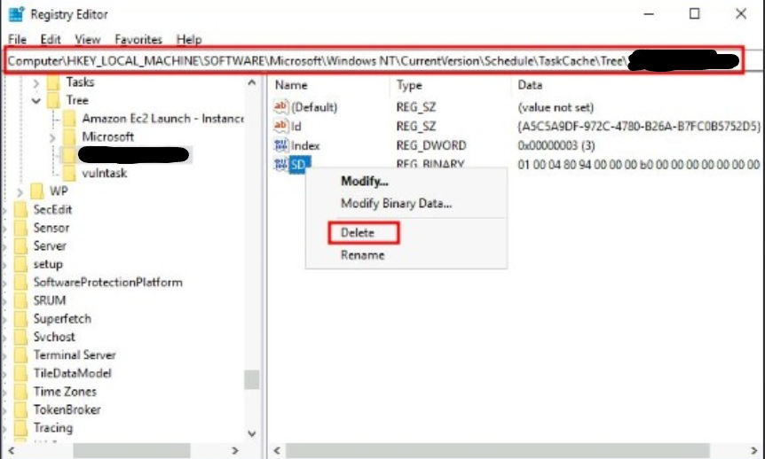

### Scheduled Tasks
Scheduled tasks in Windows automate the execution of programs or scripts at specific times or in response to events. These tasks can include system maintenance, application updates, backups, or any operation that needs regular execution without manual intervention. Attackers can misuse scheduled tasks to hide backdoors by using techniques that evade detection or execute at specific times to avoid suspicion.

### Usage of Scheduled Tasks
- **Stealth Execution:** A backdoor can run as a scheduled task with a benign or inconspicuous name, making it less likely to be noticed by users or security software.
- **Randomized Execution Times:** Scheduled tasks can execute at random or uncommon times to evade detection. By avoiding predictable patterns, the backdoor operates stealthily without raising suspicion.
- **Dynamic Payload:** The scheduled task can download or update the backdoor's payload from an external server at regular intervals, making detection harder as the payload changes frequently.
- **Low Priority:** Assigning the scheduled task a low priority ensures it operates in the background without interfering with normal system operation, reducing the likelihood of detection.
- **Conditional Execution:** The backdoor can execute only under specific conditions—such as when certain files or processes are present—to avoid detection by antivirus or security software that relies on signatures or behavior analysis.

### Evasion Technique
> The SD (Security Descriptor), essentially an Access Control List (ACL), dictates which users can access the scheduled task. By removing this descriptor, we render the task invisible to all users, including administrators. Windows only displays tasks that users have permission to use, so restricting access conceals our activity.
- **Locate the SDs:** All scheduled tasks' security descriptors are stored in `HKLM\\SOFTWARE\\Microsoft\\Windows NT\\CurrentVersion\\Schedule\\TaskCache\\Tree\\`. Each task has a corresponding registry key containing an `SD` value.
- **Erase the SD:** Only `SYSTEM privileges` allow you to delete these values. Use tools like `psexec` to open Regedit with SYSTEM access.
- **Remove the SD for Our Task:** Target the `Backdoor` task and delete its SD value.
    
    
    

> This maneuver keeps our task hidden, evading detection even under scrutiny.

---

##### A supporter is worth a thousand followers! [Buy Me a Coffee](https://www.buymeacoffee.com/dx73r). If you like this blog, follow me on [GitHub](https://github.com/dx7er) and [LinkedIn](https://www.linkedin.com/in/naqvio7/). 
