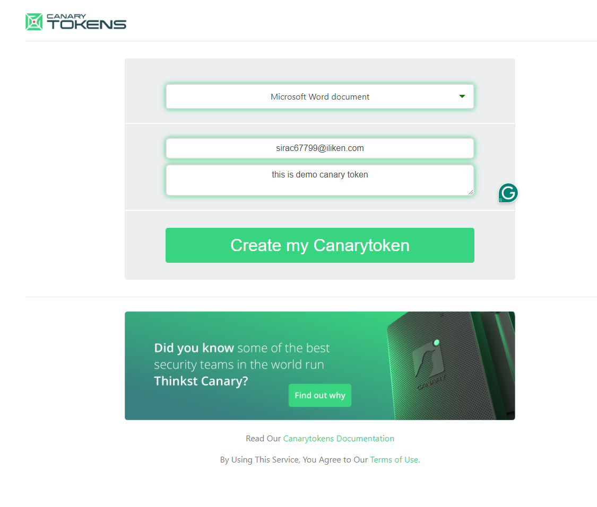
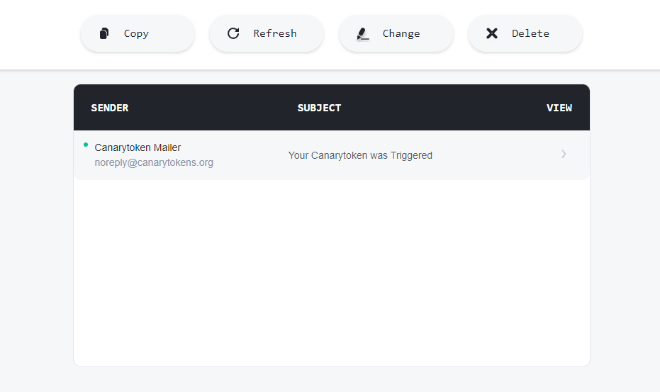
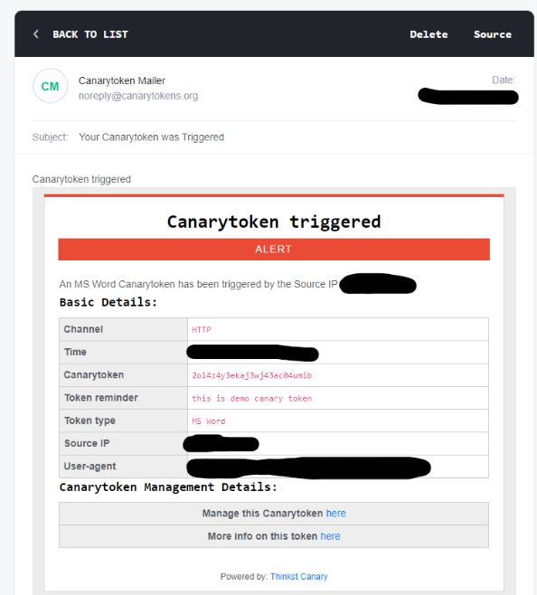

Lets dive into a fascinating topic: tracking someone's IP using files. We'll break down the concept first before delving into a step-by-step guide. While crafting custom code is an option, there's a simpler way. Buckle up, and let's get started!

### Canary Tokens

Canarytokens are a simple way to tripwire things. An old concept, they can be super useful (and are trivial to use) but require some background infrastructure to get working. Canarytokens are just like `honeypots` that lures attackers whenever `your` network is accessed. 

### How it Works:

Canarytokens function like tripwires. You strategically place them within your system, monitoring for specific actions like file access, database queries, or unusual program executions. Think of them as hidden alarms in different rooms of your castle, ready to sound the moment an unauthorized presence triggers them.

>Canarytokens are a free, easy, and fast way to help you know right away if someone is messing around in your systems.

But in `our case` we will use them to `track`, `identify` and `locate` the person we want by just sending him/her a legitimate file.

### Step By Step Guide

- Go to [CanaryToken](https://canarytokens.org/generate) and choose your Canarytoken. This is like setting up a `digital trap`. Provide `an email` where you want to be notified and a note to remind yourself where you placed it.
- [Temp Mail](https://temp-mail.org/en/) services can be used to setup email on which you want to be notified.
- Create a `CanaryToken`.

- Click on Create button. Your file containing canary token will be downloaded.
- Send the file to `target person`.
- As soon as person open the file, you will get alert on the provided email. 
- Required information can be seen in the recived email from `canarytokens.org` 

>You can also rename the generated PDF/Excel/Word document without affecting its operation.

---

##### A supporter is worth a thousand followers! [Buy Me a Coffee](https://www.buymeacoffee.com/dx73r). If you like this blog, follow me on [GitHub](https://github.com/dx7er) and [LinkedIn](https://www.linkedin.com/in/naqvio7/).

