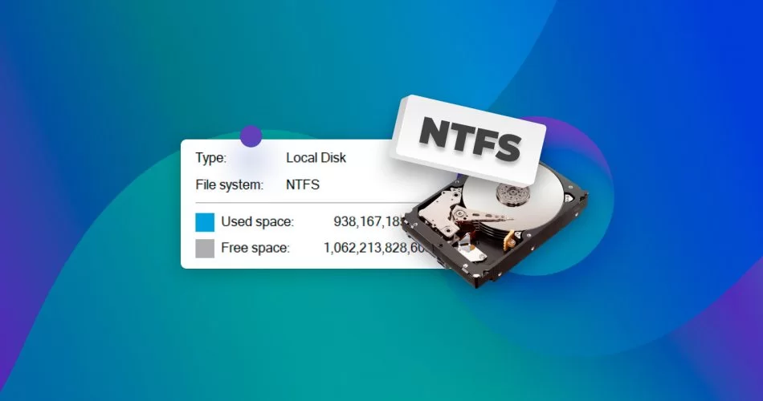

# NTFS Explained: Architecture, Security Features, and Forensic Value

## Introduction

The **New Technology File System (NTFS)** is a proprietary file system developed by Microsoft and is the default file system for modern Windows operating systems. NTFS is classified as a **journaling file system**, meaning it maintains consistency and integrity by recording changes in a transaction log before applying them to the disk.

From a **cybersecurity and digital forensics** standpoint, NTFS is one of the most important file systems to understand due to its rich metadata, strong security controls, and detailed logging mechanisms. This blog explores NTFS from a technical, security, and forensic analysis perspective.


## What Makes NTFS Different?

NTFS was designed to overcome the limitations of older file systems such as FAT32. It supports larger volumes, stronger security, better reliability, and advanced recovery features.

### Key Characteristics

* Developed by **Microsoft**
* Journaling file system
* Designed for **reliability, security, and scalability**
* Widely used in **enterprise and forensic environments**

NTFS maintains file system consistency by **logging changes in a journal** before committing them to disk. In the event of a system crash or power failure, NTFS can replay the journal to restore the file system to a consistent state.


## Core NTFS Features

### Advanced Metadata

NTFS stores extensive metadata for every file and directory, including:

* File creation time
* Modification time
* Access time
* Metadata change time

**Forensic Importance:**
These timestamps are critical for **timeline reconstruction**, incident analysis, and detecting unauthorized file activity.


### Journaling

NTFS uses a transactional journal (stored in `$LogFile`) to track file system changes.

**Benefits:**

* Enables crash recovery
* Preserves file system integrity
* Provides an audit trail of file system operations

**Forensic Importance:**
The journal can reveal evidence of recent file operations even when files are deleted or modified.


### Security Features

NTFS provides advanced security mechanisms:

* **Access Control Lists (ACLs)**
* **Encrypting File System (EFS)**

These features allow administrators to control who can access specific files and directories.

**Forensic Importance:**
ACLs and EFS metadata can be analyzed to understand access patterns, privilege abuse, and potential security breaches.


### Large Volume Support

NTFS supports extremely large disks and file sizes, making it suitable for modern storage requirements.


### Resilience

NTFS is significantly more resilient to corruption than FAT-based file systems due to:

* Journaling
* Self-healing mechanisms
* Redundant metadata structures


### Compression

NTFS supports transparent file compression, allowing data to be stored efficiently without user intervention.


### Compatibility

* Native to Windows
* Read support on Linux and macOS
* Write support available using third-party drivers


## NTFS vs FAT32 vs exFAT

| Feature            | NTFS                   | FAT32          | exFAT            |
| ------------------ | ---------------------- | -------------- | ---------------- |
| Max Drive Size     | 256 TB                 | 2 TB           | 128 PB           |
| Max File Size      | 256 TB                 | 4 GB           | 16 EB            |
| Crash Recovery     | Yes                    | No             | No               |
| Encryption         | Yes                    | No             | No               |
| Compression        | Yes                    | No             | No               |
| File Permissions   | Yes                    | No             | No               |
| Reliability        | High                   | Low            | Moderate         |
| Cross-Platform Use | Limited                | Universal      | Universal        |
| Best Use Case      | Modern Windows systems | Legacy systems | External storage |


## NTFS Architecture Overview

```
    NTFS FEATURES
        |
----------------------------------------
|            |            |            |
Security   Journaling   Metadata     Resilience
|            |            |            |
ACLs      Transaction   Timestamps   Self-Healing
EFS        Logging       File Streams Filesystem
            |
       Crash Recovery
            |
     Checkpoint Mechanism
```


## NTFS Components

### Partition Boot Sector (PBS)

The **Partition Boot Sector** is the first sector of an NTFS volume.

**Contains:**

* File system identifier (NTFS)
* BIOS Parameter Block (BPB)
* Cluster size
* Location of `$MFT` and `$MFTMirr`
* Boot code
* End-of-sector marker (`0x55AA`)

**Forensic Value:**

* Reveals disk layout and boot configuration
* Can be examined for boot-sector tampering


### Master File Table (MFT)

The **Master File Table (MFT)** is the backbone of NTFS.

**Key Characteristics:**

* Central database of file system metadata
* Fixed-size records (typically 1 KB)
* Every file and directory has an MFT entry
* Stores timestamps, permissions, and data location

**Resident vs Non-Resident Attributes:**

* Small files: stored directly in the MFT
* Large files: stored as data runs pointing to disk locations

**Forensic Value:**

* Deleted file records may persist
* Essential for timeline analysis
* Useful for detecting metadata manipulation


### `$MFTMirr` (MFT Mirror)

* Duplicate copy of the first MFT records
* Stored at a different disk location
* Provides redundancy and recovery capability

**Forensic Value:**

* Used to validate MFT integrity
* Can recover metadata if MFT is corrupted


### NTFS System Files

NTFS uses internal system files to manage operations:

* `$MFT` – Master File Table
* `$MFTMirr` – MFT Mirror
* `$LogFile` – Transaction journal
* `$Bitmap` – Cluster allocation map
* `$Boot` – Boot sector
* `$BadClus` – Bad sector tracking
* `$UpCase` – Case-insensitive character mapping

**Forensic Value:**

* `$LogFile` reveals historical operations
* `$Bitmap` shows allocation patterns
* `$BadClus` may indicate intentional data hiding


### File Data Area

The **Data Area** stores actual file contents.

* Data stored as clusters (data runs)
* Referenced by non-resident MFT attributes

**Forensic Value:**

* Primary source for file recovery
* Slack space and fragments may contain residual data


### Alternate Data Streams (ADS)

Alternate Data Streams allow multiple data streams per file.

* Primary stream: visible file content
* Alternate streams: hidden data or metadata
* Does not affect visible file size

**Forensic Value:**

* Common technique for data hiding
* Frequently abused by malware


## NTFS Components Map

```
                NTFS COMPONENTS
                      |
--------------------------------------------------------------
|            |              |             |                  |
MFT      Security &       $I30 Index   Alternate Data       Journaling
         Permissions      Attribute     Streams (ADS)
|            |              |             |                  |
Metadata   ACLs           Directory     Hidden data        File system
Records    EFS            indexing      storage            consistency
|
1KB records

                    Transaction Log
                         ($LogFile)
```


## Conclusion

NTFS is far more than just a file system, it is a **rich source of forensic evidence** and a cornerstone of Windows security architecture. Understanding NTFS internals is essential for cybersecurity professionals, malware analysts, and digital forensic investigators.

From **metadata analysis** and **timeline reconstruction** to **data recovery** and **anti-forensics detection**, NTFS provides deep visibility into system activity. Mastery of NTFS structures is a critical skill for anyone working in modern digital investigations.<br>

---
##### A supporter is worth a thousand followers! [Buy Me a Coffee](https://www.buymeacoffee.com/dx73r). If you like this blog, follow me on [GitHub](https://github.com/dx7er) and [LinkedIn](https://www.linkedin.com/in/naqvio7/).
