# NTFS at Byte Level: Tracing a File from GPT to Deletion

> **TL;DR** — I manually traced a file (`Abbas.txt`) from the GPT Partition Table through the NTFS Boot Sector, MFT, Root Directory, and INDX blocks entirely in raw hex. Then I deleted it and compared what changed across every key NTFS structure. Spoiler: deleting a file in NTFS changes almost nothing.

---

## Why This Matters

Most people interact with file systems through GUIs. You drag something to the bin, it's gone. Except it isn't. Not even close.

Understanding how NTFS manages files at the byte level is foundational to digital forensics. You can't understand what forensic tools are recovering, why certain artifacts survive, or how anti-forensics techniques work without understanding the underlying structures. So I decided to skip the tools entirely and do it manually raw hex dumps, manual calculations, offset-by-offset analysis.

This post documents the full process: locating the NTFS partition in a raw disk image, walking through each NTFS component in sequence, then analysing the forensic implications of deletion at every layer.

### Lab Setup

- **Disk Image:** `usb_ntfs_cw2.img` — USB drive formatted NTFS
- **File Created:** `Abbas.txt` containing `Syed`, placed in root directory
- **Volume Label:** `SyedMuhammadSaqlainAbbas`
- **Cluster Size:** 32KB (32,768 bytes)
- **Partition Size:** ~1.58 GB
- **Tools:** `dd`, hex editor, manual byte calculations

---

## Part 1 — Finding the NTFS Partition via GPT

Before touching any NTFS structure, I needed to locate where the partition actually lives on disk. That means starting at LBA 0 and walking the GUID Partition Table.

### Protective MBR — LBA 0

The first sector is the Protective MBR. Its sole job is signalling to firmware that this disk uses GPT. It holds one partition entry where the 4th byte is `0xEE`, the GPT indicator.

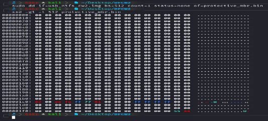
*Fig 1 — Protective MBR. The `EE` byte at the partition type offset signals GPT scheme to the firmware.*

### Primary GPT Header — LBA 1

The GPT header at LBA 1 contains 92 useful bytes: signature, CRC32 checksums, number of partition entries, and the starting LBA of the Partition Entry Array (LBA 2). Remaining 420 bytes are reserved and must be zero.

### GPT Partition Entry Array — LBA 2

The actual partition information lives here — type GUID, unique GUID, and the **starting LBA** of each partition.

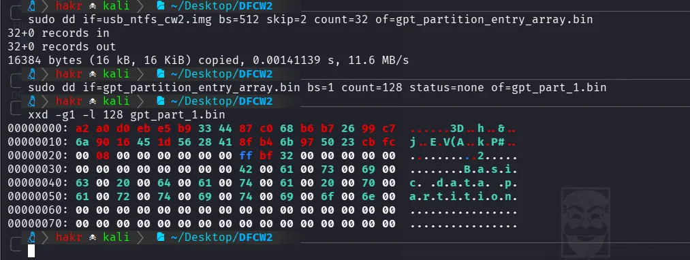
*Fig 2 — GPT Partition Entry Array. NTFS partition type GUID visible alongside the starting LBA.*

Starting LBA from offset `0x20` (8 bytes, little-endian):

```
Starting LBA: 00 08 00 00 00 00 00 00  (little-endian)
→ Big-endian: 00 00 00 00 00 00 08 00
→ Decimal:    2048
```

**The NTFS partition starts at LBA 2048.** Every subsequent calculation is relative to this.

---

## Part 2 — Walking the NTFS Structures

### NTFS Boot Sector / VBR

The Boot Sector sits at the first sector of the NTFS volume (LBA 2048). It's the map of the entire filesystem (cluster size), total sectors, and most importantly, the location of the Master File Table.

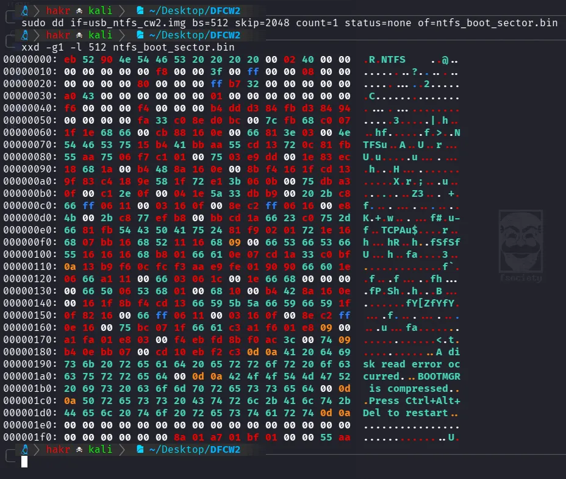
*Fig 3 — NTFS Boot Sector. OEM ID `4E 54 46 53 20 20 20 20` = "NTFS    " confirms filesystem type.*

| Offset | Hex Value | Field | Value |
|--------|-----------|-------|-------|
| `0x03` | `4E 54 46 53 20 20 20 20` | OEM ID | "NTFS" |
| `0x0B` | `00 02` | Bytes per Sector | 512 |
| `0x0D` | `40` | Sectors per Cluster | 64 |
| `0x28` | `FF B7 32 00 00 00 00 00` | Total Sectors | 3,323,903 |
| `0x30` | `A0 43 00 00 00 00 00 00` | MFT LCN | 17,312 |
| `0x1FE` | `55 AA` | Boot Signature | Valid |

**Cluster Size:**
```
Cluster Size = Bytes per Sector × Sectors per Cluster
             = 512 × 64
             = 32,768 bytes (32 KB)
```

**MFT Location** — LCN stored at offset `0x30`, converted to absolute LBA:
```
MFT LCN bytes: A0 43 00 00 00 00 00 00  (little-endian)
→ Big-endian:  00 00 00 00 00 00 43 A0
→ Decimal:     17,312

MFT LBA = Partition Start + (MFT LCN × Sectors per Cluster)
        = 2,048 + (17,312 × 64)
        = 1,110,016
```

```bash
sudo dd if=usb_ntfs_cw2.img bs=512 skip=1110016 count=32 status=none of=mft_first_16_records.bin
```

---

### Master File Table (MFT)

The MFT is the central database of NTFS every file and directory gets an entry here. The first 16 entries are reserved system metadata files:

| Entry | Name | Role |
|-------|------|------|
| 0 | `$MFT` | The MFT itself |
| 1 | `$MFTMirr` | Backup of first 4 MFT records |
| 2 | `$LogFile` | Transaction journal |
| 3 | `$Volume` | Volume label, version, flags |
| 5 | `$Root` | Root directory |
| 6 | `$Bitmap` | Cluster allocation bitmap |

**Volume Label — MFT Entry 3 (`$Volume`)**

The partition name isn't in the GPT entry. It's inside the `$VOLUME_NAME` attribute of MFT record 3, encoded as UTF-16LE at offsets `0x118` to `0x140`:

```
53 00 79 00 65 00 64 00 4D 00 75 00 68 00 61 00 6D 00 6D 00 61 00 64 00 ...
→  S     y     e     d     M     u     h     a     m     m     a     d  ...
→ "SyedMuhammadSaqlainAbbas"
```

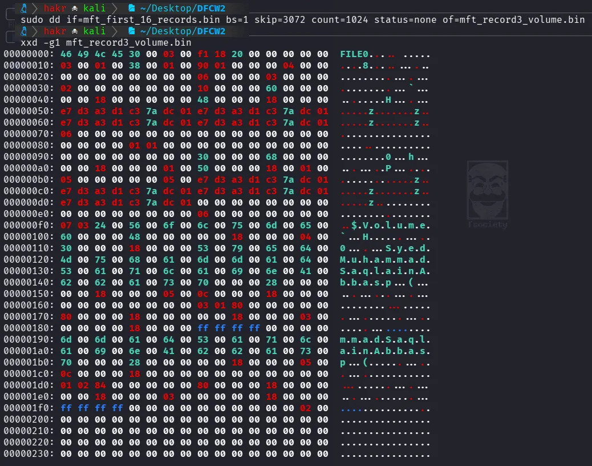
*Fig 4 — MFT Record #3 (`$Volume`). `$VOLUME_NAME` attribute holds the partition label in UTF-16LE.*

**MFT Record #0 (`$MFT`)**

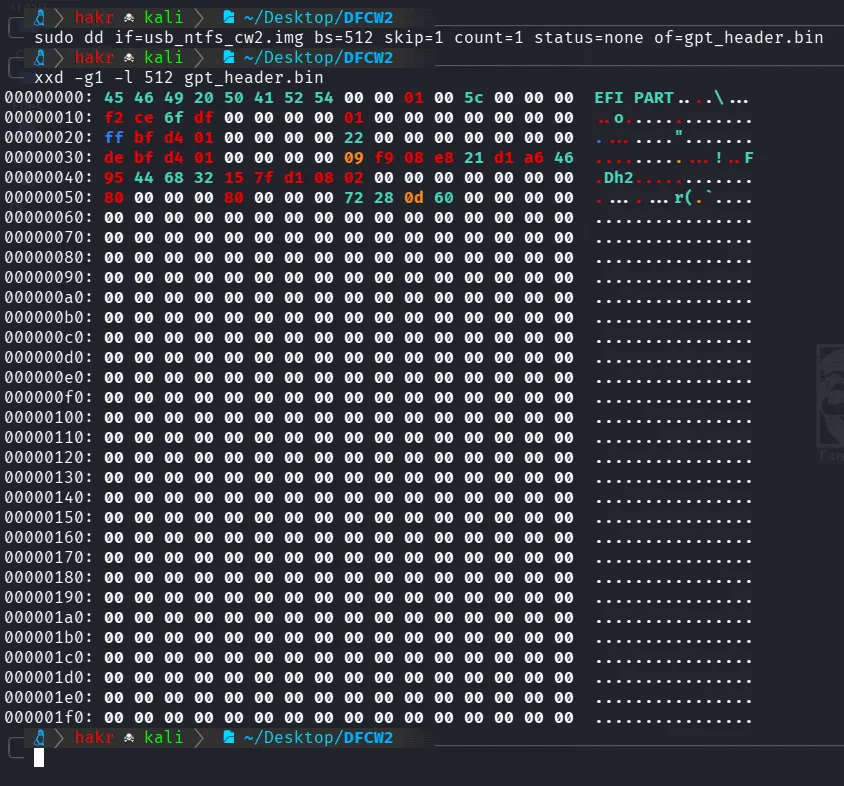
*Fig 5 — MFT Record #0. FILE signature, first attribute offset, and the `$STANDARD_INFORMATION` → `$FILE_NAME` → `$DATA` attribute chain.*

| Offset | Hex | Field | Value |
|--------|-----|-------|-------|
| `0x00` | `46 49 4C 45` | Signature | "FILE" |
| `0x10` | `01 00` | Sequence Number | 1 |
| `0x14` | `38 00` | First Attribute Offset | 56 bytes |
| `0x18` | `98 01 00 00` | Bytes Used | 408 bytes |
| `0x1C` | `00 04 00 00` | Bytes Allocated | 1024 bytes |

---

### Root Directory — MFT Entry 5

The root directory is always MFT entry 5 in NTFS, the `C:\` starting point. Beyond the standard attributes, it has two extra ones that implement the directory index:

- **`$INDEX_ROOT`** — Resident, defines the B+Tree index structure
- **`$INDEX_ALLOCATION`** — Non-resident, Data Runs pointing to INDX blocks on disk

```
Root MFT LBA = MFT Start LBA + (5 × 2)    ← 2 sectors per 1024-byte MFT record
             = 1,110,016 + 10
             = 1,110,026
```

```bash
sudo dd if=usb_ntfs_cw2.img bs=512 skip=1110026 count=2 status=none of=mft_entry5_root.bin
```

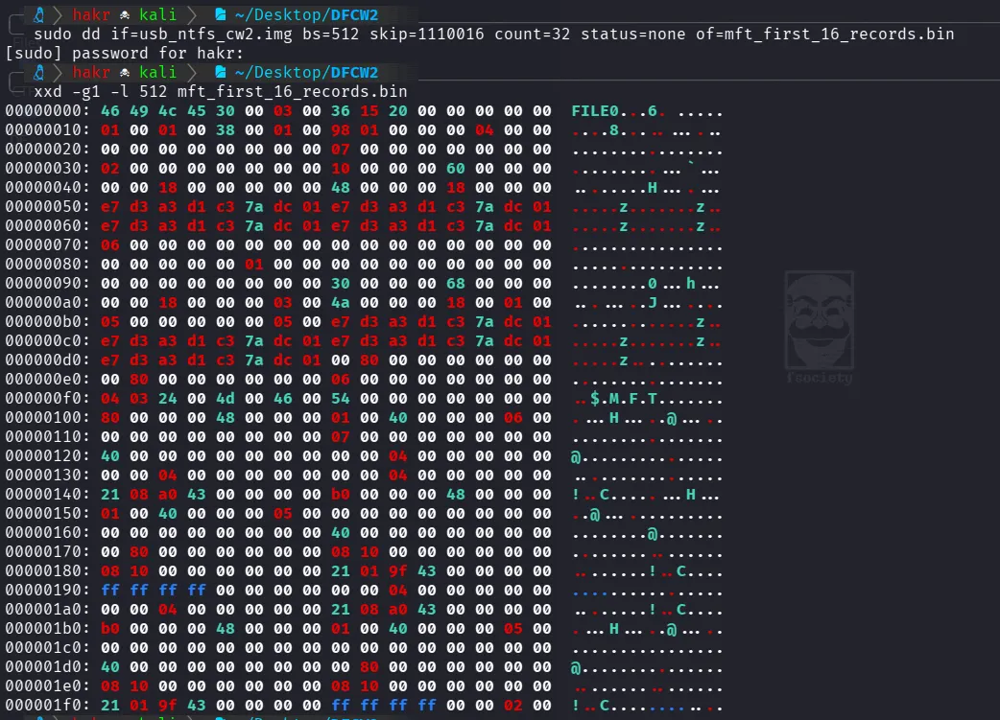
*Fig 6 — Root Directory MFT record. `$INDEX_ROOT` (resident) and `$INDEX_ALLOCATION` (non-resident) attributes with B+Tree node structure.*

**Finding the INDX Block via `$INDEX_ALLOCATION`**

The mapping pair / Data Run at `$INDEX_ALLOCATION` offset `0x1C8`:

```
Run List: 11 01 07 00
→ 0x11: high nibble = 1 byte for length, low nibble = 1 byte for LCN
→ 0x01: run length = 1 cluster
→ 0x07: LCN = 7

Absolute LBA = Partition Start + (LCN × Sectors per Cluster)
             = 2,048 + (7 × 64)
             = 2,496

Byte Offset  = 2,496 × 512 = 1,277,952
```

```bash
sudo dd if=usb_ntfs_cw2.img bs=512 skip=2496 count=8 status=none of=indx_blk.bin
```

---

### INDX Block — Locating Abbas.txt

The INDX block contains `$I30` index entries one per file/folder in the directory. Each entry maps a filename to its MFT record number.

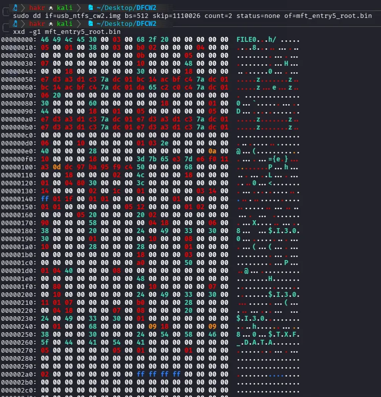
*Fig 7 — INDX Block. `Abbas.txt` entry with MFT entry number 47 and sequence number 2.*

From offset `0x040`:

```
First 6 bytes = MFT Entry Number: 2F 00 00 00 00 00 → 47
Last 2 bytes  = Sequence Number:  02 00             → 2
File Name:      41 00 62 00 62 00 61 00 73 00 2E 00 74 00 78 00 74 00
             →  A     b     b     a     s     .     t     x     t
             → "Abbas.txt"
```

**Abbas.txt is at MFT Entry 47.**

---

### MFT Entry 47 — Abbas.txt

This is the target. Since the file is only 4 bytes, the content is stored **resident inside the MFT record** no separate clusters allocated.

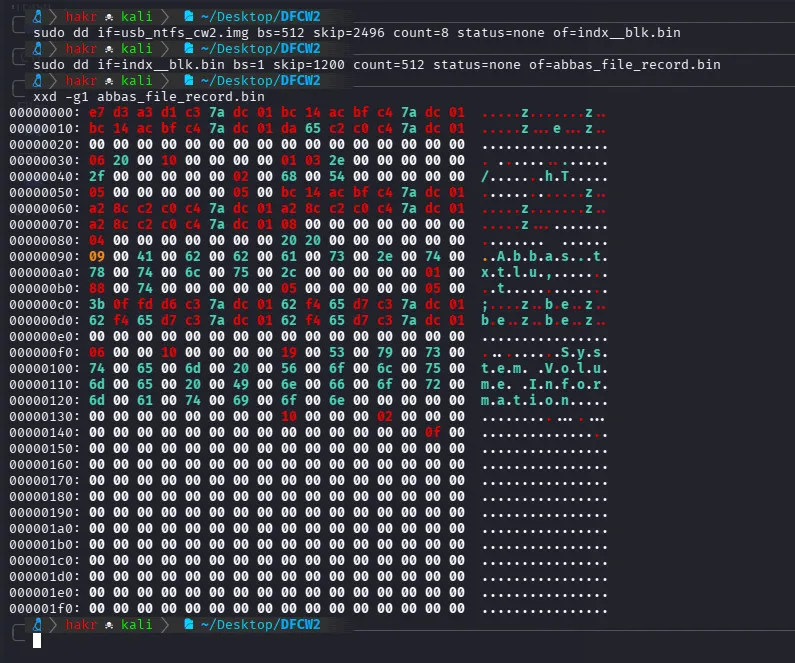
*Fig 8 — Full MFT analysis of `Abbas.txt`. `$DATA` at offset `0x108` contains `53 79 65 64` = "Syed". Everything resident.*

| Offset | Hex Value | Field | Value |
|--------|-----------|-------|-------|
| **Record Header** | | | |
| `0x00` | `46 49 4C 45` | Signature | "FILE" |
| `0x16` | `01 00` | Flags | In Use |
| `0x18` | `30 01 00 00` | Used Size | 304 bytes |
| `0x1C` | `00 04 00 00` | Allocated Size | 1024 bytes |
| `0x2C` | `2F 00 00 00` | MFT Record Number | **47** |
| **$STANDARD_INFORMATION** | | | |
| `0x50` | `BC 14 AC BF C4 7A DC 01` | Creation Time | 2026-01-01 02:17:16 UTC |
| `0x58` | `BC 14 AC BF C4 7A DC 01` | Modified Time | 2026-01-01 02:17:18 UTC |
| **$FILE_NAME** | | | |
| `0xB0` | `05 00 00 00 00 00` | Parent Directory | MFT Entry 5 (Root) |
| `0xF0` | `09` | Filename Length | 9 characters |
| `0xF2` | `41 00 62 00 62 00 61 00...` | Filename | Abbas.txt |
| **$DATA** | | | |
| `0x110` | `00` | Residency Flag | Resident |
| `0x120` | `53 79 65 64` | File Content | **"Syed"** |
| `0x128` | `FF FF FF FF` | End Marker | End of record |

---

## Part 3 — What Happens When You Delete the File?

File deletion in NTFS is a **metadata operation**, not data destruction. The filesystem updates a handful of structural fields to mark the file inactive, nothing more.

### MFT Entry — Before vs. After

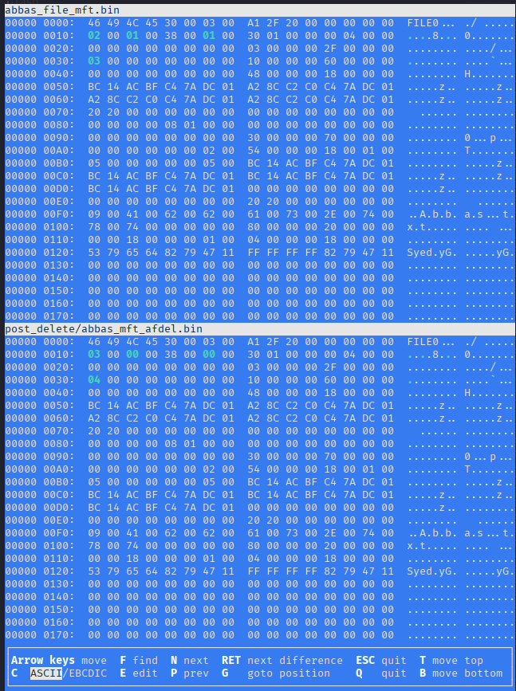
*Fig 9 — MFT Entry comparison. Only 4 fields change. Filename and content remain intact.*

| Offset | Before | After | Field | Change |
|--------|--------|-------|-------|--------|
| `0x010` | `02 00` | `03 00` | Sequence Number | 2 → 3 |
| `0x012` | `01 00` | `00 00` | Hard Link Count | 1 → 0 |
| `0x016` | `01 00` | `00 00` | MFT Record Flags | **In Use → Free** |
| `0x028` | `03 00 00 00` | `04 00 00 00` | Next Attr ID | 3 → 4 |

> The filename `Abbas.txt` and file content `Syed` remain **completely intact** in the MFT record. NTFS just flips the in-use flag. Users think deletion removes their data. It doesn't.

---

### Root Directory — Before vs. After

The root directory content is unchanged. Only the `$STANDARD_INFORMATION` timestamps update.

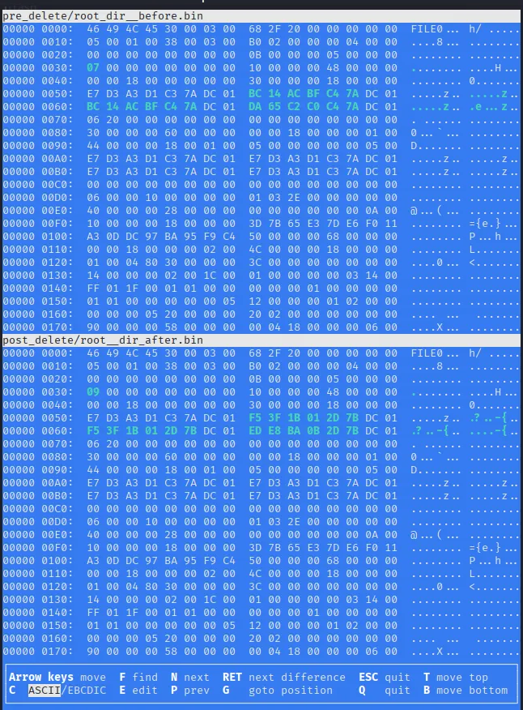
*Fig 10 — Root Directory timestamps update on deletion. Everything else untouched.*

| Field | Before | After |
|-------|--------|-------|
| File Modified | 2026-01-01 02:17:16 UTC | 2026-01-01 14:43:33 UTC |
| MFT Modified | 2026-01-01 02:17:16 UTC | 2026-01-01 14:43:33 UTC |
| Last Access | 2026-01-01 02:17:18 UTC | 2026-01-01 14:43:51 UTC |

---

### INDX Block — Before vs. After

Most visible structural change at directory level the `$I30` entry for `Abbas.txt` is removed, timestamps update, index size adjusts.

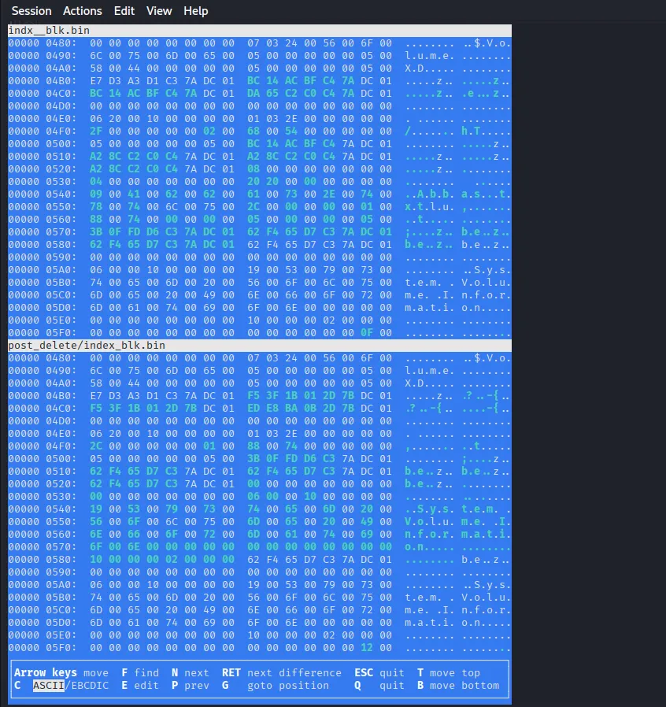
*Fig 11 — INDX Block comparison. `Abbas.txt` `$I30` entry removed; index entry size reduced from 47 to 44 bytes.*

| Offset | Before | After | Change |
|--------|--------|-------|--------|
| `0x04B8` | `BC 14 AC BF...` | `F5 3F 1B 01...` | File Modified Time updated |
| `0x0540` | `Abbas.txt` entry | Entry absent | **$I30 entry removed** |
| `0x04F0` | `2F 00 00 00` (47) | `2C 00 00 00` (44) | Index entry size reduced |

---

### $Bitmap — No Change

`$Bitmap` tracks cluster allocation across the volume. Since `Abbas.txt` data was resident inside the MFT (4 bytes, never allocated clusters), there's nothing to deallocate.

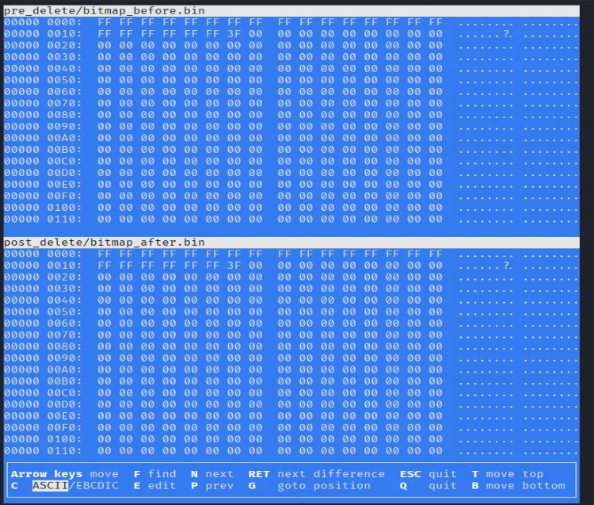
*Fig 12 — `$Bitmap` byte-identical before and after deletion. Resident data leaves zero cluster footprint.*

---

### $LogFile — Journal Recycled

When I extracted and compared `$LogFile` before and after deletion, it was filled with `0xFF` — the journal had been recycled.

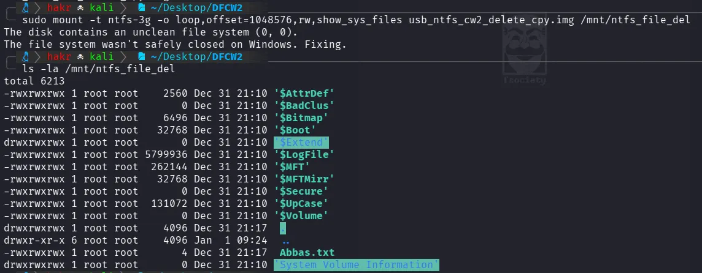
*Fig 13 — `ntfs-3g` detects dirty state on mount and automatically replays the journal, wiping transaction history.*

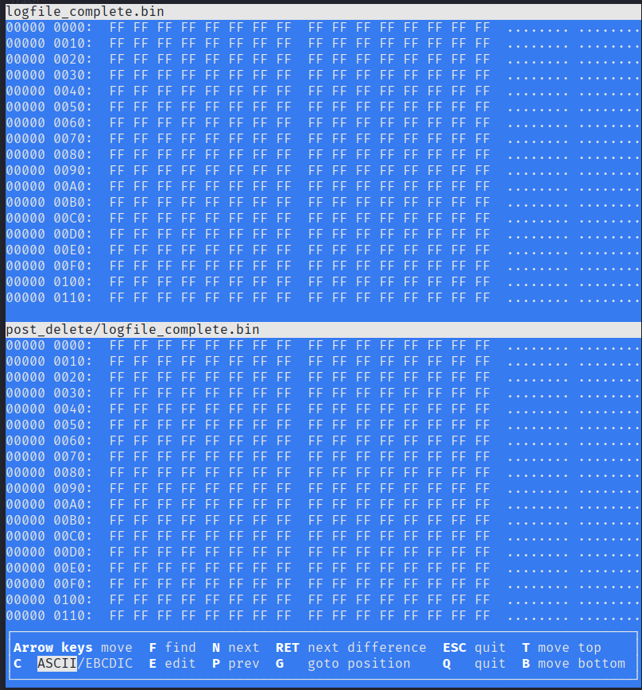
*Fig 14 — `$LogFile` dump filled with `0xFF`. Journal cleared by NTFS automatic recovery during mount.*

The cause: the USB wasn't safely ejected from Windows, leaving it dirty. When mounted in Kali with `ntfs-3g` in read-write mode, NTFS detected the dirty flag and automatically replayed all pending transactions, clearing the log.

> **Forensic implication:** `$LogFile` is volatile. Never mount a target volume read-write before imaging. This is exactly why hardware write blockers exist.

---

## Part 4 — NTFS Features and Their Forensic Impact

### Features That Help Recovery

**Master File Table**: Even after deletion, MFT entries persist until overwritten. For small files with resident data, both the filename and content survive in the same record. MFT carving is one of the most reliable forensic techniques in Windows environments.

**$LogFile (when intact)**: Transaction records can reconstruct a timeline of metadata operations: creations, deletions, renames. But volatile, don't rely on it post-mount.

### Features That Complicate Recovery

**Alternate Data Streams (ADS)**:  NTFS allows files to carry multiple named data streams beyond the default `$DATA`. These are invisible to standard directory listings. A known anti-forensics technique — investigators who only look at visible files miss them entirely.

**Encrypting File System (EFS)**: Filesystem-level encryption tied to user certificates. If the private key is lost, the ciphertext is forensically unrecoverable. No key, no data, no workarounds.

**MFT Entry Overwriting**: Standard deletion doesn't overwrite MFT entries. Purpose-built secure deletion tools do and that defeats the residual metadata recovery technique entirely.

---

## Key Takeaways

1. **Deletion is a metadata operation.** Only 4 fields change in the MFT record. Filename and content survive intact until the entry is reused.
2. **The MFT is the forensic gold mine.** Every file ever created has an entry. Deleted entries persist and for resident files, the content is right there.
3. **NTFS navigation is a chain.** GPT → Boot Sector → MFT → Root Directory → INDX Block → File MFT Entry. Each structure points to the next.
4. **$Bitmap doesn't track resident data.** If content lived inside the MFT, Bitmap never knew about it and has nothing to clear on deletion.
5. **$LogFile volatility is real.** Mounting a dirty volume triggers automatic journal replay. Always image first, analyse offline.
6. **Tools abstract the complexity.** Real forensic understanding means knowing what those tools are actually looking at and why certain data survives.

---

## Appendix — Full Navigation Chain

```
LBA 0        →  Protective MBR      →  0xEE confirms GPT
LBA 1        →  Primary GPT Header  →  Partition Entry Array at LBA 2
LBA 2        →  GPT Partition Entry →  NTFS starts at LBA 2048
LBA 2048     →  NTFS Boot Sector    →  MFT LCN=17312 → MFT LBA=1,110,016
LBA 1110016  →  $MFT (entry 0)      →  Root Directory at entry 5
LBA 1110026  →  Root Directory      →  $INDEX_ALLOCATION → LCN 7 → LBA 2496
LBA 2496     →  INDX Block          →  Abbas.txt → MFT Entry 47
MFT Entry 47 →  Abbas.txt           →  Content "Syed" at offset 0x120
```

---

*All analysis performed on a raw disk image using `dd` and manual hex extraction. No automated forensic tools used in the core analysis.*

##### A supporter is worth a thousand followers! [Buy Me a Coffee](https://www.buymeacoffee.com/dx73r). If you like this blog, follow me on [GitHub](https://github.com/dx7er) and [LinkedIn](https://www.linkedin.com/in/naqvio7/).
