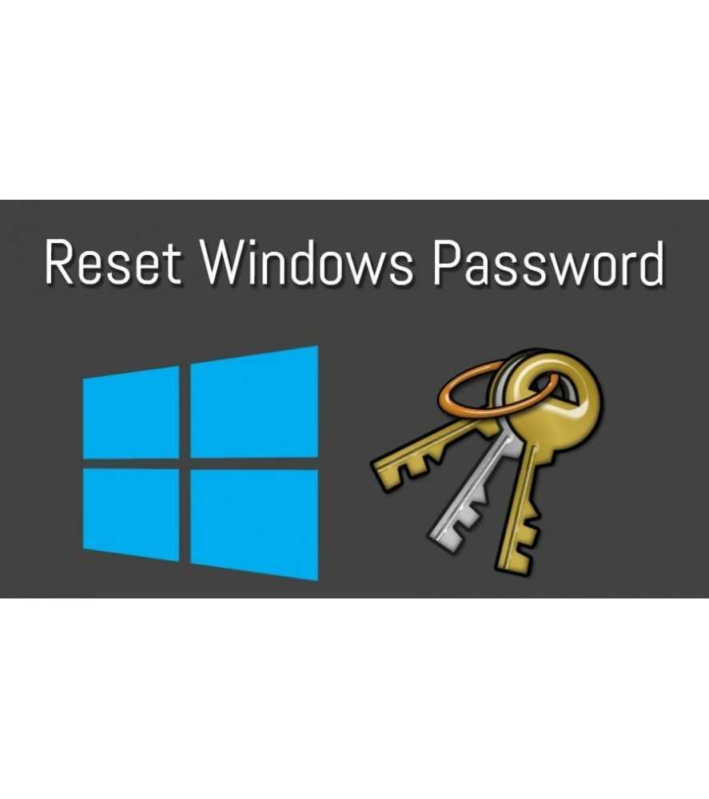

Forgetting or losing access to a Windows computer due to a forgotten password can be frustrating. However, there's a way to bypass the password without formatting the hard disk or losing data. In this blog, I'll explain how to use Kali Linux and the chntpw tool to remove user passwords on a Windows machine.

### Prerequisites
Before we start, ensure you have the following:
- Kali Linux ISO image: You can download this from the official [Kali Linux website](https://www.kali.org/).
- A USB drive with at least 4GB of storage: This will be used to create a bootable Kali Linux USB.
- Rufus software: This tool helps create bootable USB drives. Download it from Rufus' [official website](https://rufus.ie/).
- A locked Windows computer: The computer you need to access.

### Process
1. Create a Bootable Kali Linux USB
```
1. Download the Kali Linux ISO image
Visit the official Kali Linux website and download the latest ISO image.

2. Install Rufus on your computer
If you don't already have Rufus, download and install it from the official website.

3. Launch Rufus and select the Kali Linux ISO image
Open Rufus. Under "Boot selection," click the "SELECT" button and choose the downloaded Kali Linux ISO image.

4. Choose the USB drive
Ensure your USB drive is plugged in and select it in Rufus under the "Device" section.

5. Create the bootable USB drive
Click "START" to begin the process of creating a bootable USB drive with Kali Linux. Rufus will format the USB drive and copy the necessary files.
```

2. Boot from the Kali Linux USB
```
1. Plug the Kali Linux USB drive into the locked Windows computer
Insert the USB drive into the computer that you need to unlock.

2. Restart the computer
Restart the computer to begin the boot process.

3. Enter the BIOS or boot menu
During bootup, press the designated key (such as Esc, F2, F12, Del, etc.) to enter the BIOS or boot menu. The key varies by manufacturer.

4. Select the Kali Linux USB drive as the boot device
In the BIOS or boot menu, select the USB drive containing Kali Linux as the boot device. This will start the computer using Kali Linux.
```

3. Bypass the Windows Password
```
1. Load the Kali Linux operating system
Once Kali Linux loads, click on the "File System" icon on the desktop.

2. Access the Windows installation drive
In the file manager, find and select the drive where the locked Windows installation resides. It’s usually the largest partition.

3. Open a terminal in the drive's directory
Right-click in an empty space within the drive's file system and choose "Open Terminal Here."

4. Navigate to the Windows password file location
Use the cd command to navigate to the /Windows/System32/config/ directory:
>> cd /mnt/sda1/Windows/System32/config/

Note: Replace /mnt/sda1 with the actual mount point of your Windows partition.

5. List all existing users
Execute the following command to list all users:
>> samdump users

6.Identify the user and remove the password
Identify the user whose password you want to remove. Then execute the following command, replacing "username" with the actual user name:
>> chntpw -u username SAM

Note: When prompted, select option 1 to "Clear (blank) user password."

7. Save changes
Press q to quit and then y to save the changes.
```

4. Restart and Log In
```
1. Restart the computer
Shut down or restart the computer and remove the Kali Linux USB drive.

2. Log in to Windows
When the computer restarts, you should be able to log in to Windows without entering a password.
```

### Conclusion
By following these steps, you can bypass the password on a Windows computer without formatting the hard disk or losing any data. This method uses `Kali Linux` and the `chntpw` tool to modify the `Windows SAM` files and `registry`, effectively removing the password. 


---

##### A supporter is worth a thousand followers! [Buy Me a Coffee](https://www.buymeacoffee.com/dx73r). If you like this blog, follow me on [GitHub](https://github.com/dx7er) and [LinkedIn](https://www.linkedin.com/in/naqvio7/). 

